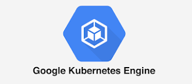

#   GCP
 Google Cloud Platform (GCP), offered by Google, 
 is a suite of cloud computing services that
 runs on the same infrastructure that Google
 uses internally for its end-user products,
 such as Google Search, Gmail, file storage, 
 and YouTube
 
# GKE
 Google Kubernetes Engine (GKE) provides a managed 
 environment for deploying, managing, and scaling
 your containerized applications using Google
 infrastructure. The GKE environment consists of 
 multiple machines (specifically, Compute Engine 
 instances) grouped together to form a cluster.

# TASK DESCRIPTION :

1. Create multi projects with dev and prod

2. Create VPC network for dev project

3. Create VPC network for prod project

4. Connect both the VPC network with VPC peering

5. Create a Kubernetes Cluster in dev project and launch a wordpress/Joomla application with the Load balancer

6. Create a SQL server in prod project and create a database

7. Connect the SQL database with the application launched in the K8s cluster

# SOLUTION

# STEP 1:

Creating the infrastructure  we are creating two projects in different regions.
let One project be called Production and other one for Developer.

Creating A Project for Production 
 

Creating A Project for Developer
 

# STEP 2:

Within the projects we have to create VPC( Virtual Private cloud).

Creating VPC for Production Environment

 
 
 
 
 Creating VPC for developer Environment
  
  
  
  

# STEP 3:

Since we have created both the VPC in different Regions so for making connection between them so that 
wordpress can connect to our database. These VPCs can be connected trough VPC Peering.
We have to do vpc peering in both the VPCs.

Through Developer VPC

 
  
 
Through Production VPC

 

# STEP 4:

For deploying our wordpress on Google Cloud PLatform we are creating a Kubernetes cluster with one of the
service of GCP known as GKE(Google Kubernetes Engine).

Now for launching wordpress on GKE, we have to connect to GKE,here i'm connecting through cloud shell provided by GCP.
Also for doing the same we can install GOOGLE Cloud SDK in our system and have to configure kubectl to control pods.

We can see the nodes og the cluster with the command

       kubectl get nodes

Now we can deploy our wordpress by creating the deployment.
  
    kubectl create deployment wordpress  --image=wordpress

For checking the running pods we can run the command

     kubectl get pods

After the deployment havebeen created, we have to expoe our deployment to connect to this wordpress site
We are using LoadBalancer as a service to expose the deployment on the port number 80.
Command

      kubectl expose deployment wordpress --type=LoadBalancer --port=80

After we exposed our deployment we require the external IP and port number to connect to wordpress site.
For this we have to run the command 

     kubectl get svc
     
     
   
  
  
  
     
 # Step 5:
 Now we require a database to store the data of the wordpress for backend. Here we will use SQl service of 
 GCP, using this service we will launch mysql database in Production.
 
 
 
 
 
 We can add network to public ip to connect.
  
 
 
  
 We can create new database in the mysql or we can use the precreated database.
 
  
  
  
 # STEP 6:
 Now using the external IP we can connect to our wordpress site, here we'll require our database details to connect our 
 wordpress to backend database.
 
 
 
 
 
 
 
 
     
     
     
   This is All About this  Project
   THANK YOU!!
     
     
     
     
     
     
     
     
     
     
     
     
     
     
     
     
     
